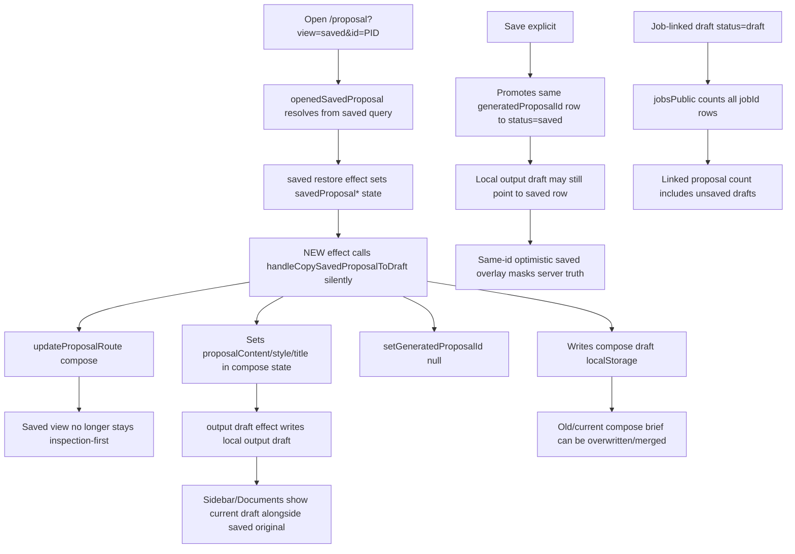

# Proposal Forge Save / Autosave / Library Audit

Date: 2026-05-05
Branch: `proposal-polish`
Scope: active `v1` code paths only. No patch applied.

## Confirmed facts

- Active route `/proposal` renders `my-app/src/pages/ProposalForge.tsx` via `my-app/src/App.tsx`.
- Saved proposal listing is Convex-backed and filtered to `status === "saved"` in `my-app/convex/proposalsPublic.ts`.
- Generation creates a Convex `proposals` row with `status: "pending"` in `my-app/convex/generateProposalMutation.ts`, then `my-app/src/components/ProposalInputForm.tsx` patches that row to `status: "draft"`.
- `ProposalForge` now autosaves compose output rows through `performProposalSave(...)` with `status: "draft"` by default, and explicit save calls `flushScheduledProposalSave(..., { status: "saved" })`.
- Current uncommitted branch code adds an effect that automatically calls `handleCopySavedProposalToDraft({ showFeedback: false })` when a saved proposal opens. This mutates compose/output draft state and navigates back to compose.
- Convex proposal metadata validators allow only explicit metadata fields. Supported heading-related fields are `applicantName`, `applicantRole`, `contactLine`, `letterDate`, `recipientDetails`, and header visibility booleans. There is no standalone `subject` or `salutation` metadata field; subject is currently `title` / `proposalDocumentTitle`, and salutation is embedded in `content`.
- Documents and Sidebar already filter server proposals to `status === "saved"`, but both also surface local output/compose draft state.
- Job-linked proposal counts are derived from any row with matching top-level `proposal.jobId`, not just saved rows, in `my-app/convex/jobsPublic.ts`.

## Inference / risk

- `status: "draft"` vs `status: "saved"` is the right library boundary: drafts may be persisted for protection and job linkage, but must not appear in proposal library queries.
- `generatedProposalId` should point to the current editable draft row while status is `draft`. After explicit save, either the same row is promoted to `saved` and no longer treated as current draft, or a saved copy is created and the current draft id is cleared. The current implementation promotes the same row but keeps local output draft pointing at it, which causes same-id optimistic overlays and draft/library ambiguity.
- The new auto-copy-on-open effect is the largest current regression: opening a saved proposal becomes duplicate-to-draft implicitly, not inspection/load of saved document.

## Active code path map

| System | Active files / functions | Status |
| --- | --- | --- |
| Proposal route | `my-app/src/App.tsx` -> `ProposalForge` | active |
| Generation form | `my-app/src/components/ProposalInputForm.tsx::handleSubmit` | active |
| Generation persistence | `my-app/convex/generateProposalMutation.ts` -> `internal.proposals.storeProposal` | active |
| Generated row draft patch | `ProposalInputForm.tsx` calls `updateGeneratedProposal({ status: "draft" })` | active |
| Compose output local draft | `my-app/src/lib/proposal-output-draft.ts` | active |
| Compose input local draft | `my-app/src/lib/proposal-workspace-state.ts` | active |
| Compose autosave | `ProposalForge.tsx::buildComposeSaveSnapshot`, `performProposalSave`, `scheduleProposalSave`, `flushScheduledProposalSave` | active |
| Explicit save | `ProposalForge.tsx::handleSaveOutputToLibrary` | active |
| Saved view restore | `ProposalForge.tsx` saved restore effect | active |
| Duplicate saved to draft | `ProposalForge.tsx::handleCopySavedProposalToDraft` | active, currently auto-triggered |
| Saved proposal editing | `ProposalForge.tsx::persistOpenedSavedProposal`, `handleSavedProposalDocumentCommit`; `ProposalsList.tsx` selected-save path | active |
| Saved list query | `my-app/convex/proposalsPublic.ts` | active |
| Documents library | `my-app/src/pages/DocumentsPage.tsx` | active |
| Sidebar recents | `my-app/src/components/Sidebar.tsx` | active |
| Job -> proposal | `my-app/src/components/jobs/JobsWorkspace.tsx::handleCreateProposal` -> `/proposal?jobId=...` | active |
| Job context in forge | `ProposalForge.tsx` `canonicalJobRecord = jobsPublic.getById` and `ProposalRail` props | active |
| Job linked proposals | `my-app/convex/jobsPublic.ts::getById` and list projection | active |

## Intended state machine

```mermaid
stateDiagram-v2
  [*] --> Empty
  Empty --> CurrentDraft: generate from Proposal Forge / Job page
  CurrentDraft --> CurrentDraft: autosave draft\nConvex status=draft + local output draft
  CurrentDraft --> SavedProposal: explicit Save to library\nstatus=saved or saved copy created
  CurrentDraft --> Empty: delete draft\ndelete draft row + clear local draft
  SavedProposal --> SavedProposal: open/load saved\ninspect/edit saved row only
  SavedProposal --> CurrentDraft: Duplicate to draft\nclear source saved id; clone local draft or create new draft row
  SavedProposal --> Empty: delete saved proposal\ndelete saved row only
  Empty --> CurrentDraft: load job-linked generated proposal\njobId preserved
  CurrentDraft --> SavedProposal: explicit Save\njobId retained
```

## Current broken behavior / state leaks

## Current vs old vs desired

| Area | Current behavior | Old/pre-polish intended behavior | Desired corrected behavior | Owning files/functions | Risk |
| --- | --- | --- | --- | --- | --- |
| Generation | Generation creates pending row, client patches draft, local output draft stores id | Same draft patch existed on `main` | Keep draft row; never list as saved | `ProposalInputForm.tsx`, `generateProposalMutation.ts` | Medium |
| Autosave | Autosaves generated output to Convex `status: draft` | Before branch, compose snapshot defaulted `status: saved`; docs wanted draft protection | Keep `draft` autosave but isolate from library | `ProposalForge.tsx` save funcs | Medium |
| Explicit save | Same row promoted to `saved`, navigates saved route | Save-to-library docs say promote/open saved record | OK if local current draft is cleared/detached after promotion | `handleSaveOutputToLibrary` | High |
| Open saved | Opens saved then silently duplicates to draft and leaves saved route | Decision doc says saved view is inspection-first | Do not mutate current draft on open; load saved into saved editor only | saved restore effect; auto-copy effect | Critical |
| Duplicate to draft | Explicit button exists, but same logic also auto-runs | Explicit `Duplicate to draft` only | Only user action duplicates; new draft must be detached from saved original | `handleCopySavedProposalToDraft` | Critical |
| Saved editing | Saved document state separate via `savedProposal*` and `persistOpenedSavedProposal` | Saved view editable/inspectable through Proposal Forge | Preserve, avoid compose mutation | `persistOpenedSavedProposal`, `ProposalDisplay` | Medium |
| Job-linked generate | `/jobs/:id` navigates `/proposal?jobId=id`, generation payload carries jobId | Jobs PRD wants linked docs | Preserve jobId in draft row and saved row | `JobsWorkspace`, `ProposalForge`, `ProposalInputForm` | Medium |
| Linked proposal count | Counts all rows with top-level `jobId` | Docs say linked generated documents; ambiguity on drafts | Decide: UI count should label draft vs saved or count saved only for library-like badges | `jobsPublic.ts` | Medium |
| Heading fields | Applicant/recipient/date persisted in metadata; subject as title; salutation in content | Header visibility decision separates compose/saved display | Keep only supported metadata; do not add unsupported fields | schema/create/update/proposalsPublic, `ProposalDisplay` | High |
| Documents | Lists saved proposals plus one local draft | PR5 Documents target: Proposals/CVs/Drafts tabs | Continue: proposals tab saved only, drafts tab current local/draft only | `DocumentsPage.tsx` | Low |
| Sidebar | Lists saved proposals plus local current draft; has optimistic same-id saved overlay | Sidebar recents should not duplicate current draft as many saved docs | Filter saved by status, show one current draft, clear same-id draft after promotion | `Sidebar.tsx` | Medium |

## Convex validator / schema boundary

Allowed proposal row fields: `userId`, top-level `jobId`, `title`, `content`, `status`, `version`, timestamps, `sections`, `metrics`, `metadata`.

Allowed metadata includes source fields, style fields, tone fields, heading fields, character limits, and `proposalType`. Unsupported fields such as `subject`, `salutation`, arbitrary `heading`, or nested applicant/recipient objects will fail validators in `schema.ts`, `createProposalPublic.ts`, `updateProposalPublic.ts`, `proposalsPublic.ts`, and `proposals.ts`.

Boundary recommendation:

- `title`: document subject / library title.
- `content`: full proposal body including salutation.
- `metadata.applicantName/applicantRole/contactLine`: applicant override snapshot.
- `metadata.letterDate/recipientDetails`: proposal-specific heading snapshot.
- `metadata.headerShow*`: visibility overrides.
- top-level `jobId` plus `metadata.jobId`: job linkage. Keep both in sync when present.

## What belongs in local storage

`dasti:proposal-compose-draft:v1`:
- current compose inputs: job title, job description, source URL/platform, proposal type, voice/tone, character limit.
- No saved proposal id.

`dasti:proposal-output-draft:v1`:
- current editable generated draft snapshot only: content, type, style, heading overrides, title, output mode, `generatedProposalId` while it is a draft row, character limit, and source compose snapshot.
- Should be cleared or detached when that row is promoted to saved.
- Should not be overwritten just by opening a saved proposal.

## What belongs in Convex proposal rows

Draft row (`status: "draft"`):
- generated content protected by autosave.
- top-level `jobId` when generated from job context.
- validated metadata snapshot needed to restore the draft.
- Should be excluded from `proposalsPublic` and proposal library.

Saved row (`status: "saved"`):
- independent library document.
- validated metadata snapshot, including heading/style/job linkage.
- Editable in saved view without touching current draft unless user duplicates.

## Places where saved load mutates current draft state

- `ProposalForge.tsx` automatic `loadedSavedProposalToDraftRef` effect calls `handleCopySavedProposalToDraft({ showFeedback: false })`.
- `handleCopySavedProposalToDraft` writes `dasti:proposal-compose-draft:v1`, sets compose preview/source seed, mutates content/style/title state, clears `generatedProposalId`, and routes to compose.
- Output draft sync effect then writes `dasti:proposal-output-draft:v1` from that mutated compose state.

## Duplicate-to-draft recommendation

Smallest clean correction: duplicate should not create a Convex row immediately. It should clone into local editable draft with `generatedProposalId = null`; first autosave or explicit save should create a new `status: "draft"`/`saved` row through `createProposalPublic`. This preserves a clear saved original and avoids server clutter from accidental duplicates. If the product requires cross-device duplicate continuity immediately, then create a new `status: "draft"` row on duplicate, but never reuse the saved id.

## Proposed implementation plan

1. Remove the automatic saved-to-draft effect. Opening `/proposal?view=saved&id=...` must stay in saved context.
2. After explicit save promotes a draft row to saved, clear or detach `dasti:proposal-output-draft:v1` so `generatedProposalId` no longer points to a saved row as the current draft.
3. Keep `proposalsPublic` saved-only. Add/confirm a separate draft query only if cross-device draft restore is required.
4. Ensure `proposalPersistenceMetadata` writes `jobId` when `canonicalJobId` or prefill jobId is present, so create-path drafts keep top-level `jobId` through `createProposalPublic`.
5. Decide job count semantics: count saved-only for library badges, or count both and label `draft/saved`. Implement in `jobsPublic.ts` consistently.
6. Keep heading persistence inside existing metadata validators; do not add unsupported `subject`/`salutation` metadata without schema/query/mutation updates.
7. Add focused tests: open saved does not mutate local drafts; duplicate mutates local draft and clears id; save after duplicate creates a new row; job-linked generation preserves `jobId`; Documents/Sidebar show one draft and saved-only library rows.

## Verification performed

- Read project and wiki instructions in required order.
- Read targeted wiki pages for Jobs, Match, Export, and overview.
- Inspected active code paths and current branch diff/history with `rtk git`.
- No browser/runtime test executed; this is a code-path audit only.
