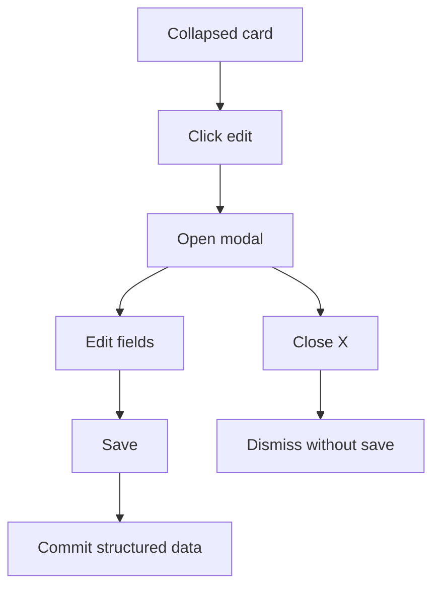
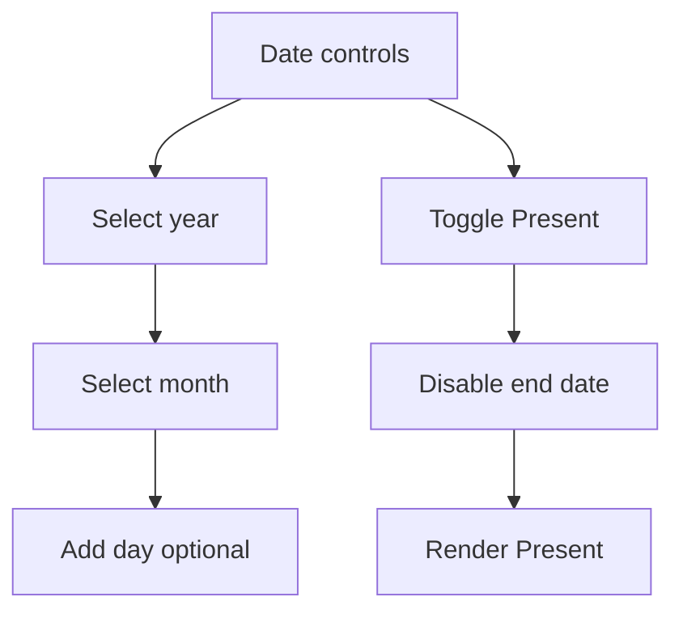

# CV Builder v1 (MVP) – Architecture and Implementation Spec

This document defines the MVP scope for the CV Builder based on the updated roadmap. It formalizes data model changes, UI composition, modal workflows, date precision, and test strategy. Where applicable, references to current files are provided for integration points:
- [cvDocument.schema.ts](my-app/src/schemas/cvDocument.schema.ts)
- [cvDocument.ts](my-app/src/types/cvDocument.ts)
- [normalize-cv.ts](my-app/src/lib/normalize-cv.ts)
- [cv-template.ts](my-app/src/lib/cv-template.ts)
- [SelectedBlockInspector.tsx](my-app/src/components/SelectedBlockInspector.tsx)
- [RichSummary.tsx](my-app/src/components/cv-display/RichSummary.tsx)
- [BlockRenderer.tsx](my-app/src/components/cv-editor/BlockRenderer.tsx)


## 1. Structured Content Model

MVP Sections:
- Profile: personal details
- Summary: free text description
- Experience: cards with modal editor
- Education: cards with modal editor
- Skills and Languages: chips in collapsed card, dropdown level in modal

Notes:
- Precision-aware dates: store both ISO value and precision metadata
- Ongoing roles: explicit isCurrent flag, only render Present when true
- Do not infer Present from empty endDate


### 1.1 TypeScript interfaces

These extend current shapes in [cvDocument.ts](my-app/src/types/cvDocument.ts), aligning with Zod updates.

```ts
// Common date precision
export type DatePrecision = 'year' | 'month' | 'day';

// Profile
export interface IProfileItem {
  id?: string;
  name?: string;
  photoUrl?: string;
  email?: string;
  phone?: string;
  linkedin?: string;
  website?: string;
  desiredPosition?: string;
  location?: string;
}

// Summary
export interface ISummaryItem {
  id?: string;
  summary?: import('remirror').RemirrorJSON | string;
}

// Experience
export interface IExperienceItem {
  id?: string;
  company: string;
  position: string;
  location?: string;
  startDate: string;
  startDatePrecision?: DatePrecision;
  endDate?: string | null;
  endDatePrecision?: DatePrecision;
  isCurrent?: boolean;              // canonical ongoing flag
  currentlyWorking?: boolean;       // legacy
  description?: import('remirror').RemirrorJSON | string;
}

// Education
export interface IEducationItem {
  id?: string;
  institution: string;
  degree?: string;
  fieldOfStudy?: string;
  location?: string;
  startDate?: string;
  startDatePrecision?: DatePrecision;
  endDate?: string | null;
  endDatePrecision?: DatePrecision;
  isCurrent?: boolean;
  description?: import('remirror').RemirrorJSON | string;
}

// Skill and Language
// Avoid TS enums per guidelines; use string union at TS level, map at runtime for labels.
export type Level = 'beginner' | 'basic' | 'intermediate' | 'advanced' | 'excellent';

export interface ISkillItem {
  id?: string;
  name: string;
  level: Level;
}

export interface ILanguageItem {
  id?: string;
  name: string;
  level: Level;
}
```


### 1.2 Zod schemas

Extend [cvDocument.schema.ts](my-app/src/schemas/cvDocument.schema.ts) to include new shapes in StructuredContent union and runtime validation. Follow the maps-over-enums guideline by:
- accepting strings and refining to a known set
- centralizing level names in a map object for display and i18n

Example schema direction (pseudocode):

```ts
// Pseudocode sketch, implement in Zod:
const LevelStrings = ['beginner','basic','intermediate','advanced','excellent'] as const;
const LevelSchema = z.string().transform(s => s.trim().toLowerCase()).refine(v => LevelStrings.includes(v as any), 'Invalid level') as z.ZodType<Level>;

const ProfileItemSchema = z.object({
  id: z.string().optional(),
  name: z.string().optional(),
  photoUrl: z.string().url().optional(),
  email: z.string().email().optional(),
  phone: z.string().optional(),
  linkedin: z.string().optional(),
  website: z.string().optional(),
  desiredPosition: z.string().optional(),
  location: z.string().optional(),
}).passthrough();

const SummaryItemSchema = z.object({
  id: z.string().optional(),
  summary: z.union([RemirrorJSONSchema, z.string()]).optional(),
}).passthrough();

const SkillItemSchema = z.object({
  id: z.string().optional(),
  name: z.string(),
  level: LevelSchema,
}).passthrough();

const LanguageItemSchema = z.object({
  id: z.string().optional(),
  name: z.string(),
  level: LevelSchema,
}).passthrough();

// StructuredContent union — per section type
// - Profile: array of IProfileItem or singleton list
// - Summary: array of ISummaryItem or singleton list
// - Skills: array of ISkillItem
// - Languages: array of ILanguageItem
```


## 2. UI and UX

The editor uses a card-based SectionEditor with modals.

General rules:
- Collapsed card: minimal info only
- Edit icon to open modal
- Trash icon to remove card
- Remove red destructive button styling
- Save in modal = commit changes; Close X dismisses changes


### 2.1 Profile section
- Collapsed view:
  - avatar (if any), name, desired position
  - contact chips: email, phone, linkedin, website
- Modal fields:
  - photo upload
  - name, email, phone, linkedin, website
  - desired position, location
- Data: IProfileItem


### 2.2 Summary section
- Collapsed view:
  - single-line preview of summary text
- Modal:
  - Remirror editor for summary
- Data: ISummaryItem


### 2.3 Experience section
- Collapsed card:
  - Title: position
  - Subtitle: company • location
  - Dates: precision-aware; display Present when isCurrent
  - Remove block title; just render position/company/location/dates
- Modal:
  - Fields: position, company, location
  - Date controls: Month and Year selectors by default, Add day to reveal day field
  - Present toggle: sets isCurrent true and disables end date, endDate null
  - Description: Remirror editor
- Data: IExperienceItem


### 2.4 Education section
- Collapsed card:
  - Title: degree
  - Subtitle: institution • location
  - Dates: precision-aware; Present supported via isCurrent
- Modal:
  - Fields: institution, degree, fieldOfStudy, location
  - Date controls: Month-Year with optional day
  - Present toggle
  - Description: Remirror editor
- Data: IEducationItem


### 2.5 Skills and Languages
- Collapsed:
  - Chips: name with compact level label
- Modal:
  - List editor: each row name + level dropdown with 5 levels
- Data:
  - ISkillItem[]
  - ILanguageItem[]


## 3. Date Handling

Storage:
- ISO string normalized to UTC midnight
- Precision metadata: startDatePrecision, endDatePrecision as 'year' | 'month' | 'day'
- Ongoing roles: isCurrent true and endDate null

UI:
- Month-Year selects by default; Add day reveals numeric day field
- Present toggle: disables end date and sets isCurrent

Rendering:
- Month name when precision month; year only when precision year; full day when day
- endDate null with isCurrent true → render Present


## 4. Parsing and Import

- Parser maps extracted fields into the new skeletons:
  - Profile: name, email, phone, linkedin, website, desired position, location
  - Summary: summary text
  - Experience, Education: items with dates normalized via flexible parsing
  - Skills and Languages: items with name and level when possible
- Gaps remain editable by the user
- Backwards compatible field mapping is best-effort


## 5. Tests

Deprecate legacy tests that enforce behaviors not applicable to card-based UI. Introduce new tests:
- Skeleton generation for sections: Profile, Summary, Experience, Education, Skills, Languages
- Precision-aware date handling
- Present toggle behavior
- Rendering: collapsed cards and Present label

Note: Our current runtime changes already added precision and Present semantics. Review and migrate unit tests in:
- [cv-normalize.test.ts](my-app/src/__tests__/cv-normalize.test.ts)
- [conversion.test.ts](my-app/src/components/remirror-editor/utils/conversion.test.ts)
…to reflect v1 behaviors.


## 6. Integration Points

- Schema updates: [cvDocument.schema.ts](my-app/src/schemas/cvDocument.schema.ts)
- Types: [cvDocument.ts](my-app/src/types/cvDocument.ts)
- Template: [cv-template.ts](my-app/src/lib/cv-template.ts)
- Normalizer: [normalize-cv.ts](my-app/src/lib/normalize-cv.ts)
- Inspector Modal: [SelectedBlockInspector.tsx](my-app/src/components/SelectedBlockInspector.tsx)
- Collapsed card rendering: [BlockRenderer.tsx](my-app/src/components/cv-editor/BlockRenderer.tsx), [RichSummary.tsx](my-app/src/components/cv-display/RichSummary.tsx)


## 7. Accessibility and Design System

- Use shadcn/ui primitives, Radix, TailwindCSS
- Small, keyboard accessible edit and trash buttons on cards
- Modal focus trap
- Design tokens via CSS variables; dark/light ready


## 8. Mermaid Workflows

Editor flow:


Date input flow:



## 9. Backlog for MVP Delivery

- Implement Profile and Summary schemas and modals
- Implement Skills and Languages schemas, chips, and modals with 5-level dropdown
- Finalize Experience and Education cards without achievements; keep description block
- Ensure precision-aware date utilities and Present toggle across rendering and inspector
- Update parsing to populate new skeletons; leave gaps for manual input
- Replace legacy tests with v1 tests


## 10. Notes

- Avoid TS enums; prefer string unions and runtime maps for level labels
- Continue using structural sharing in state to minimize rerenders
- Continue debounced content syncing; persist on Save via context actions
