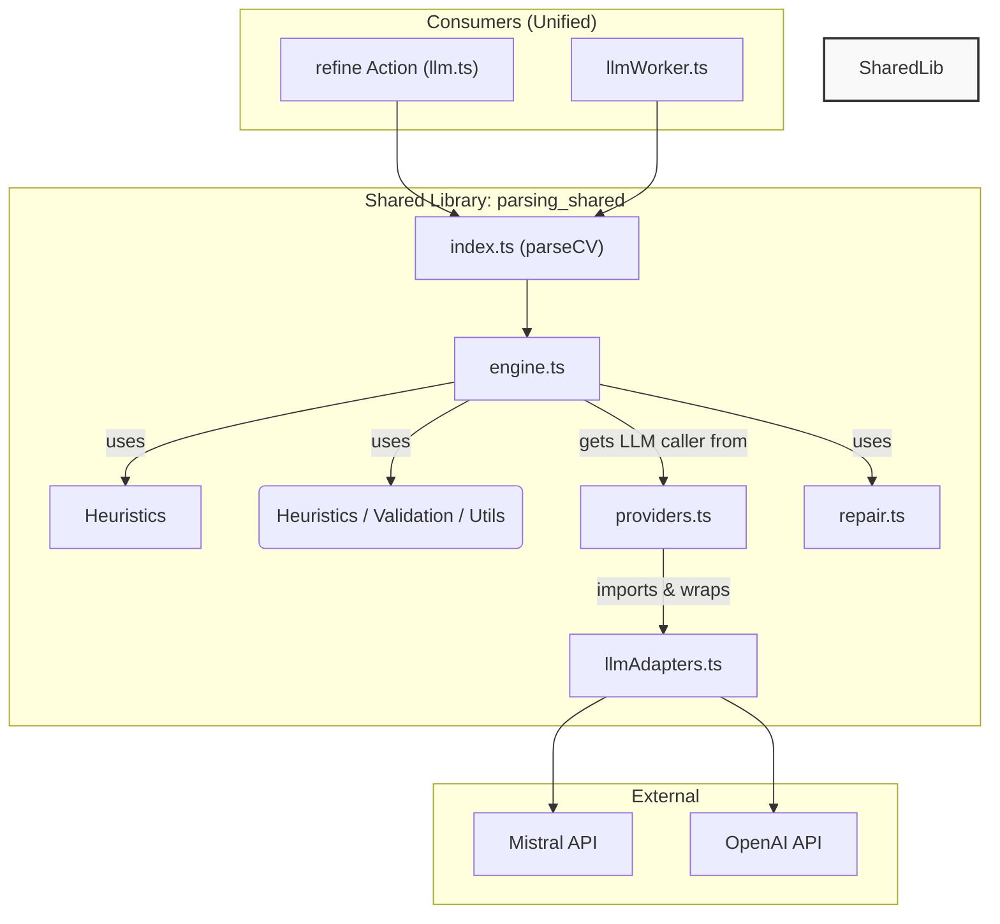

# Parsing Logic Audit & Unified Library Refactor Plan

This document outlines the findings from a review of the existing CV parsing logic and presents a refined plan for migrating to a unified, shared parsing library.

## 1. Code Review Findings

After reviewing `hybridParser.ts`, `llm.ts`, `llmWorker.ts`, and `llmAdapters.ts`, I've identified several key areas for improvement and consolidation.

### Key Observations:

*   **Divergent Parsing Paths**: The most significant issue is the divergence between the `refine` action (`llm.ts`) and the `llmWorker.ts`.
    *   **`llm.ts` (`refine`)**: Uses a simple `fetch` call directly to the Mistral API and then runs the result through `runFormatCompleteCV` (which is an action that uses `hybridParser.ts`). This path benefits from the full `hybridParser.ts` logic, including multi-stage parsing, validation, and repair.
    *   **`llmWorker.ts`**: Implements its own `callOpenAIChat` and `callMistralChat` functions. It performs a much simpler `extractPatchFromText` and a best-effort `parseLLMSections` if available on the global scope. This path is less robust and lacks the sophisticated repair and validation logic of `hybridParser.ts`.
    *   **Result**: This divergence means a CV could be parsed differently depending on whether it's processed by a `refine` job or a worker job, leading to inconsistent results.

*   **Duplicated Logic**:
    *   **LLM Calling**: Both `llmWorker.ts` and `llmAdapters.ts` contain fetch logic for OpenAI and Mistral. The worker's implementation is simpler and does not include the robust timeout, AbortSignal, and retry logic present in the adapters.
    *   **Configuration**: `llmConfig.ts` provides a central place for provider and model configuration, which is good. However, `llmWorker.ts` re-declares some of these constants, creating a potential for drift.

*   **`hybridParser.ts` is Overloaded**: This file has become a monolith containing:
    *   Low-level LLM calling logic (`callLLM`, `callLLMWithTimeout`).
    *   Provider selection and fallback logic (`callPreferredProvider`).
    *   Multi-stage parsing orchestration (`attemptLLMParse`, `parseCV`).
    *   JSON repair (`repairJSON`).
    *   Language detection (`detectLanguageIsFrench`).
    *   Heuristics (`parseWithEnhancedHeuristics`).
    *   This makes the file hard to navigate and test in isolation.

*   **French CV Handling**:
    *   The `detectLanguageIsFrench` heuristic is a good tactical solution.
    *   The language-aware timeouts and prompts within `hybridParser.ts` are effective but are *not* used by `llmWorker.ts`, which is a key gap. The worker will not apply the longer timeouts for French CVs, which may contribute to them failing more often in that path.

### Recommendations:

1.  **Prioritize Unification**: The number one priority of the refactor should be to make the `refine` action and `llmWorker` use the **exact same** parsing function from the new shared library.
2.  **Modularize `hybridParser.ts`**: Deconstruct `hybridParser.ts` into smaller, single-responsibility modules as outlined in the initial plan. This is the correct path forward.
3.  **Centralize LLM Calls**: All LLM calls must go through the `llmAdapters.ts` logic to ensure consistent timeout management, AbortSignal propagation, and telemetry. The custom fetch implementations in `llmWorker.ts` should be removed.
4.  **Configuration from a Single Source**: Both the worker and any server-side actions should consume `llmConfig` directly and avoid re-defining provider logic.

---

## 2. Refined Migration Plan

This plan is an evolution of the previous one, incorporating the findings from the code review.

### **Phase 1: Create the Shared Library and Migrate Core Utilities**

1.  **Scaffold `parsing_shared` library**:
    *   Create the directory `my-app/convex/lib/parsing_shared`.
    *   Create the file structure as previously designed (`api.ts`, `engine.ts`, `repair.ts`, etc.).
    *   Add a `README.md` explaining the purpose of the library.

2.  **Migrate Utilities (Low-risk, high-value)**:
    *   Move `repairJSON` from `hybridParser.ts` to `my-app/convex/lib/parsing_shared/repair.ts`.
    *   Move `detectLanguageIsFrench` to `my-app/convex/lib/parsing_shared/utils.ts`.
    *   Move the heuristic parsing logic (`parseWithEnhancedHeuristics`, `isPotentialHeader`) to `my-app/convex/lib/parsing_shared/heuristics.ts`.
    *   Move `validateLLMOutput` to `my-app/convex/lib/parsing_shared/validation.ts`.
    *   **Crucially**, update `hybridParser.ts` to import these functions from their new locations. All existing tests for `hybridParser.ts` should still pass, confirming the move was successful without changing behavior.

### **Phase 2: Build the Core Engine & Migrate `refine` Action**

3.  **Implement the Core Engine**:
    *   In `parsing_shared/engine.ts`, create the main `parseCV` function. This function will orchestrate the full parsing flow (LLM -> validate -> repair -> retry -> fallback to heuristics).
    *   The engine will import and use the utilities migrated in the previous step.
    *   It will *not* call LLMs directly. Instead, it will take a `llmCaller` function as a parameter, making it highly testable. `(prompt, schema, opts) => Promise<string | object>`.

4.  **Create the Provider Layer**:
    *   In `parsing_shared/providers.ts`, create a function `createLLMCaller(config)`.
    *   This function will use `llmConfig.ts` and `llmAdapters.ts` to create a concrete LLM calling function that handles provider selection, timeout/abort logic, and telemetry. This will encapsulate all the logic from `callPreferredProvider` and `callLLMWithTimeout`.

5.  **Refactor `llm.ts` (`refine` action)**
    *   Update the `refine` action in `llm.ts` to use the new shared library.
    *   The `handler` will now look something like this:
        ```typescript
        // simplified example
        const { parseCV } = await import("../lib/parsing_shared"); // Dynamic import
        const parserResult = await parseCV({ rawText: job.rawText, ... });
        // ... persist parserResult
        ```
    *   This removes the dependency on `runFormatCompleteCV` and the old `hybridParser`.

### **Phase 3: Migrate `llmWorker.ts` and Deprecate Old Code**

6.  **Refactor `llmWorker.ts`**:
    *   **Remove `callOpenAIChat` and `callMistralChat`** from the worker file entirely.
    *   Update the main loop to call the new `parsingShared.parseCV` function, just like the `refine` action.
    *   Now, both the `refine` action and the worker will have identical, robust parsing logic, including French CV-specific timeouts and prompts.

7.  **Deprecation and Cleanup**:
    *   Once both consumers are migrated, the entire `my-app/convex/lib/parsing` directory can be safely deleted.
    *   All related tests should be moved or merged into the `__tests__` directory of the new shared library.
    *   Remove `runFormatCompleteCV` action if it's no longer used elsewhere.

### **Diagram of Final Architecture**



This revised plan ensures that we leverage the best parts of the existing resilient code (`hybridParser.ts`, `llmAdapters.ts`) while eliminating the dangerous divergence and duplication that currently exists. I am ready to proceed with the first step of this plan.