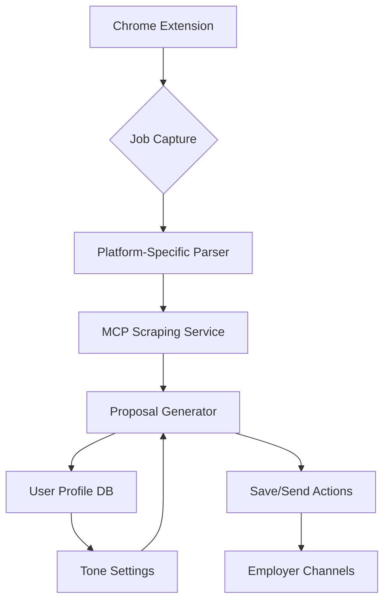

# Job Proposal Generator

A TypeScript-based system for automatically generating and managing job proposals across multiple platforms.

## Architecture

The system follows a modular, functional programming approach with strict TypeScript typing and comprehensive error handling. Key components include:



### Core Components

1. **Platform Parsers**: Type-safe implementations for different job platforms
   - Upwork Parser
   - LinkedIn Parser (planned)
   - Fiverr Parser (planned)

2. **MCP Services**:
   - Scraping Service: Handles job content extraction
   - Proposal Generator: Creates tailored proposals
   - Tone Service: Manages writing style and formality

3. **Error Handling**: Comprehensive error handling with custom error types and proper propagation

## Technical Stack

- TypeScript with strict configuration
- Functional programming approach
- Zod for runtime type validation
- MCP (Model Context Protocol) for service integration

## Getting Started

1. Install dependencies:
```bash
npm install
```

2. Configure the application:
```typescript
const app = createApplication({
  mcpServerUrl: 'https://mcp.example.com',
  mcpApiKey: 'your-api-key',
  defaultToneSettings: {
    type: 'formal',
    level: 3,
  }
});
```

3. Process a job:
```typescript
const proposal = await app.processJob({
  url: 'https://upwork.com/jobs/123',
  platform: 'upwork',
  userToken: 'user-token'
}, userProfile);
```

## Features

### 1. Job Capture
- Automatic platform detection
- URL validation and support checking
- Structured job data extraction

### 2. Proposal Generation
- Profile-based customization
- Tone control with multiple presets
- Auto-send capabilities

### 3. Tone Control
```typescript
const toneSettings: ToneSettings = {
  type: 'formal', // 'formal' | 'friendly' | 'technical'
  level: 3, // 1-5
  customInstructions: 'Optional custom tone instructions'
};
```

### 4. Error Handling
```typescript
try {
  const proposal = await app.processJob(jobRequest, userProfile);
} catch (error) {
  if ((error as McpError).type === 'VALIDATION_ERROR') {
    // Handle validation errors
  }
  // Handle other errors
}
```

## Code Examples

### Platform Parser Implementation
```typescript
function createUpworkParser(): PlatformParser {
  return {
    async parse(content: string): Promise<ParsedJob> {
      // Implementation details in src/services/platforms/upwork.ts
    }
  };
}
```

### Tone Analysis
```typescript
const analysis = app.analyzeTone(text, {
  type: 'technical',
  level: 4
});

console.log(analysis.consistency); // 0-1 score
console.log(analysis.suggestions); // Array of improvement suggestions
```

## Best Practices

1. **Type Safety**
   - Use TypeScript's strict mode
   - Define comprehensive interfaces
   - Validate all external data with Zod

2. **Error Handling**
   - Custom error types for different scenarios
   - Proper error propagation
   - Retry mechanisms for network operations

3. **Functional Programming**
   - Pure functions where possible
   - Immutable data structures
   - Composition over inheritance

4. **Testing** (TODO)
   - Unit tests for pure functions
   - Integration tests for services
   - E2E tests for full workflows

## Future Improvements

1. Additional Platform Support
   - LinkedIn integration
   - Fiverr integration
   - Custom platform parser support

2. Enhanced Tone Control
   - ML-based tone analysis
   - Industry-specific templates
   - Learning from successful proposals

3. Performance Optimizations
   - Caching layer for job data
   - Batch processing capabilities
   - Rate limiting management

## Contributing

Follow these guidelines when contributing:

1. Use TypeScript with strict mode
2. Follow functional programming principles
3. Add comprehensive error handling
4. Include proper documentation
5. Add unit tests for new features

## License

MIT License - See LICENSE file for details
