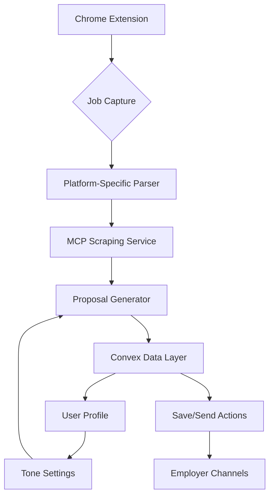

# Job Proposal Generator Architecture ✅

## System Overview ✅



## Core Components

### 1. Data Layer (Convex + Clerk) ✅
```typescript
// Primary data store with real-time capabilities
interface DataLayer {
  proposals: ConvexTable<{
    content: string;
    status: 'draft' | 'sent';
    userId: string; // Clerk user ID
    metadata: {
      platform: string;
      jobId: string;
      rateLimit: number;
    };
  }>;
  
  userProfiles: ConvexTable<{
    clerkId: string;
    writingStyle: WritingStyle;
    tonePreference: TonePreference;
    autoSend: boolean;
  }>;
}

// Optional PostgreSQL sync for analytics
interface AnalyticsStore {
  proposals: {
    convexId: string;
    content: string;
    status: string;
    createdAt: Date;
  }[];
}
```

### 2. Chrome Extension ✅
```typescript
class ProposalHandler {
  async generateAndSend(job: JobCaptureRequest) {
    // Validate rate limits
    await this.checkRateLimit(job.platform);
    
    // Generate proposal
    const content = await mcpClient.callTool('scrape_job', job);
    const proposal = await mcpClient.callTool('generate_proposal', {
      ...content,
      tone: userProfile.tonePreference
    });
    
    // Store in Convex
    await this.convex.mutation('proposals:create', {
      content: proposal,
      status: 'draft',
      metadata: {
        platform: job.platform,
        jobId: job.id
      }
    });

    // Auto-send if enabled
    if (userProfile.autoSend) {
      await this.sendToPlatform(job.platform, proposal);
    }
  }
}
```

### 3. MCP Services Structure ✅
```
/mcp
  /scraping-server
    /src
      /platforms      # Platform-specific parsers
      /tools
        scrape_job.ts
  /proposal-server
    /src
      /generators    # LangChain logic
      /tools
        generate_proposal.ts
```

### 4. Tone Control Implementation ✅
```typescript
type ToneOption = 'formal' | 'friendly' | 'technical';

const TONE_INSTRUCTIONS: Record<ToneOption, string> = {
  formal: "Use professional business language",
  friendly: "Adopt a conversational tone",
  technical: "Focus on technical specifications"
};

function applyTone(proposal: string, tone: ToneOption): string {
  return `${TONE_INSTRUCTIONS[tone]}\n\n${proposal}`;
}
```

## Key Architecture Decisions ✅

### 1. Convex as Primary Data Store ✅
- Real-time updates for proposal status
- Built-in authentication with Clerk
- Automatic ACID transactions
- Cold start <100ms vs Lambda's 300-500ms
- Optional PostgreSQL sync for analytics

### 2. Rate Limiting Strategy ✅
```typescript
interface RateLimits {
  proposalsPerHour: number;
  syncThreshold: number;
}

const checkRateLimit = async (userId: string, platform: string): Promise<boolean> => {
  const hourlyCount = await convex.query('proposals:getHourlyCount', {
    userId,
    platform
  });
  return hourlyCount < getRateLimitConfig().proposalsPerHour;
};
```

### 3. Error Handling ✅
```typescript
class ErrorHandler {
  async handle(error: Error) {
    if (error instanceof RateLimitError) {
      return this.handleRateLimit();
    }
    if (error instanceof AuthError) {
      return this.refreshAuth();
    }
    if (error instanceof NetworkError) {
      return this.retryWithBackoff();
    }
  }
}
```

## Implementation Phases

### Phase 1: Core Setup ✅
- Environment configuration ✅
- Basic scraping service ✅
- LangChain integration ✅
- Test infrastructure ✅

### Phase 2: Data Layer ✅
- Convex schema setup ✅
- Clerk authentication ✅
- Rate limiting implementation ✅
- PostgreSQL sync (optional) ◻️

### Phase 3: Platform Integration 🚧
- Auto-send functionality ✅
- Platform-specific adapters ✅
- Error recovery ✅
- Performance monitoring ◻️

## Testing Strategy ✅

### Unit Tests ✅
```typescript
describe('Proposal Generation', () => {
  it('respects rate limits', async () => {
    const handler = new ProposalHandler();
    
    // Generate up to limit
    for (let i = 0; i < getRateLimitConfig().proposalsPerHour; i++) {
      await handler.generate();
    }
    
    // Next should fail
    await expect(handler.generate()).rejects.toThrow();
  });
});
```

### Integration Tests ✅
```typescript
describe('End-to-End Flow', () => {
  it('handles full proposal lifecycle', async () => {
    const job = await scrapeJob(testUrl);
    const proposal = await generateProposal(job);
    const stored = await saveProposal(proposal);
    
    expect(stored.status).toBe('draft');
    expect(stored.content).toContain(job.requirements);
  });
});
```

## Monitoring & Alerts 🚧

### 1. Performance Metrics ◻️
- API response times
- Database query latency
- Rate limit usage
- Sync lag (if PostgreSQL enabled)

### 2. Error Tracking ◻️
- Failed proposals
- Auth failures
- Network timeouts
- Rate limit exceeded events

### 3. Usage Analytics ◻️
- Proposals per user
- Success rates
- Platform distribution
- Auto-send effectiveness

## Next Steps

1. ✅ Complete Convex setup
2. ✅ Implement Clerk authentication
3. ✅ Add rate limiting
4. ◻️ Set up monitoring
5. ◻️ Configure PostgreSQL sync (if needed)
