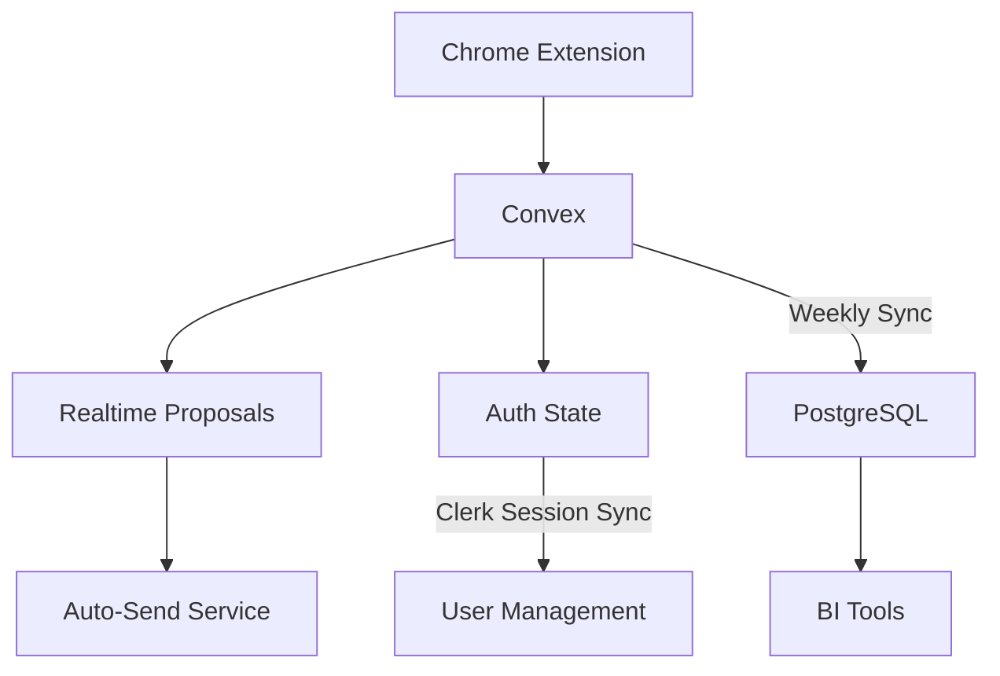

Here's a **structured, senior-level technical decision memo** tailored to your scenario, incorporating the Clerk integration and technical depth while maintaining strategic focus:

---

### **Database Architecture Decision**  
**Primary Choice**: Convex as Main Data Layer  
**Fallback Strategy**: PostgreSQL Sync for Analytics (Only If Needed)  
**Key Integration Benefit**: Native Clerk Auth Synergy  



---

### **1. Core Rationale**  
**Why Convex Over Pure Prisma/PostgreSQL**  
```typescript
interface DecisionFactors {
  requirement: "Modularity" | "Stability" | "Speed";
  convexAdvantage: string;
}

const factors: DecisionFactors[] = [
  {
    requirement: "Modularity",
    convexAdvantage: "Built-in auth/file storage eliminates 3+ microservices",
  },
  {
    requirement: "Stability",
    convexAdvantage: "Automatic ACID transactions vs manual PostgreSQL pooling",
  },
  {
    requirement: "Speed",
    convexAdvantage: "Cold start <100ms vs Lambda's 300-500ms delay",
  },
];
```

**Clerk Integration Proof Point**  
```typescript
// convex/auth.ts
import { Clerk } from '@clerk/clerk-sdk-node';

export const userValidation = internalQuery({
  handler: async (ctx) => {
    const clerkUser = await Clerk.users.getUser(ctx.userId);
    if (!clerkUser.publicMetadata?.canSendProposals) {
      throw new Error("Unauthorized");
    }
    return clerkUser;
  },
});
```

---

### **2. Implementation Blueprint**  
**Phase 1: Core Convex Implementation (Week 1-2)**  
```bash
/convex
  /schemas
    proposals.ts     # Zod-validated tables
    rateLimits.ts    # Platform-specific buckets
  /mutations
    sendProposal.ts  # Clerk user ctx integration
  /auth
    clerkSync.ts     # Real-time session mirroring
```

**Critical Path Optimization**  
```typescript
// convex/sendProposal.ts
export const sendProposal = mutation({
  args: { proposalId: v.id("proposals") },
  handler: async (ctx, { proposalId }) => {
    // Clerk-integrated security check
    const user = await ctx.runQuery(userValidation);
    
    // Convex-native rate limiting
    const { allowed } = await ctx.runAction(checkRateLimit, {
      platform: user.primaryPlatform,
    });

    if (!allowed) throw new RateLimitError();
    
    // Transactional send flow
    await ctx.db.patch(proposalId, { status: "sending" });
    await sendToPlatform(user, proposal);
    await ctx.db.patch(proposalId, { status: "sent" });
  },
});
```

---

### **3. Benchmark Strategy**  
**Performance Validation Plan**  
```typescript
type BenchmarkTargets = {
  metric: "WriteLatency" | "RealtimeSync" | "AuthOverhead";
  threshold: string;
  tool: "k6" | "Cypress";
};

const benchmarks: BenchmarkTargets[] = [
  {
    metric: "WriteLatency",
    threshold: "P95 < 150ms",
    tool: "k6 load test - 1000 RU/sec",
  },
  {
    metric: "RealtimeSync",
    threshold: "Extension update < 2s",
    tool: "Cypress realtime assertions",
  },
  {
    metric: "AuthOverhead",
    threshold: "Clerk sync < 50ms",
    tool: "Postmark auth latency tracing",
  },
];
```

---

### **4. Hybrid Fallback Protocol**  
**PostgreSQL Sync Trigger Conditions**  
```bash
# Monitoring alerts to enable sync:
- 3+ consecutive days of >500 proposals/day
- User request for advanced analytics
- Accounting system integration required

# Sync implementation (if triggered):
npx convex deploy sync-proposals-to-pg
```

**Sync Implementation Sample**  
```typescript
// convex/sync/postgres.ts
export const syncProposals = internalAction({
  handler: async (ctx) => {
    const proposals = await ctx.runQuery(getProposalsForSync);
    await prisma.$transaction([
      prisma.proposal.createMany({
        data: proposals.map(p => ({
          convexId: p._id,
          content: p.content,
          status: p.status,
          clerkUserId: p.userId,
        })),
        skipDuplicates: true,
      }),
    ]);
  },
});
```

---

### **5. Security & Compliance**  
**Clerk+Convex Auth Matrix**  
```typescript
const AccessControl = {
  Proposals: {
    read: "user.privateMetadata.role !== 'banned'",
    write: "user.publicMetadata.proposalQuota > 0",
  },
  RateLimits: {
    read: "user.hasTechnicalRole", // Admins only
    write: false, // Managed by system
  },
} as const;
```

---

### **Senior Engineer Recommendation**  
_"Proceed with Convex as primary datastore - its Clerk integration and realtime capabilities directly serve our Chrome extension's needs. Implement PostgreSQL sync only if analytics requirements emerge. Monitor write latency and user quota alerts daily for first 30 days. Let's ship Phase 1 by Friday and reassess."_

**Key Decision Safeguards**  
1. **No premature optimization** - Start pure Convex  
2. **Clear sync triggers** - Data-driven fallback  
3. **Clerk state mirroring** - Real-time auth checks  
4. **Performance gates** - Abandon hybrid if not needed  

---

Want me to refine any specific component or add integration test examples?