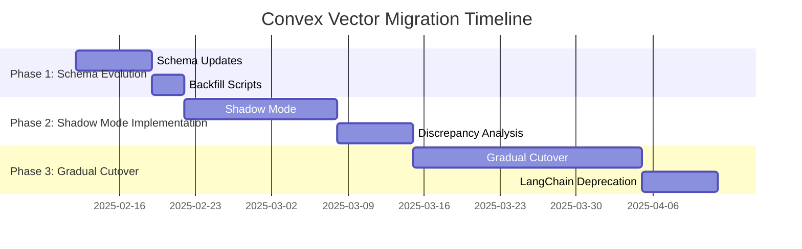

## Migration Plan: LangChain to Convex Vector Search

This document outlines the phased migration plan to transition from the current LangChain-based AI chat implementation to a pure Convex Vector Search solution. This migration aims to leverage Convex's built-in vector database for enhanced control, efficiency, and scalability.

### Phase 1: Schema Evolution

**Objective:** Introduce new tables and fields to the Convex schema to support vector embeddings and document storage for Convex Vector Search.

**Tasks:**
1. **Define new tables in `convex/schema.ts`:**
   - `vectorDocs`: To store document text content and metadata.
   - `embeddings`: To store vector embeddings linked to document chunks.
   - `cache`: (Optional) For caching embeddings to optimize costs and latency.

```typescript
// convex/schema.ts
import { defineSchema } from "convex/server";
import { v } from "convex/values";

export default defineSchema({
  ...existingSchema, // Keep existing schema

  vectorDocs: defineTable({
    embedding: v.array(v.number()),
    text: v.string(),
    sourceHash: v.string() // SHA-256 hash of original content for change detection
  }).vectorIndex("byEmbedding", {
    vectorField: "embedding",
    dimensions: 1536
  }),

  cache: defineTable({
    key: v.string(),
    value: v.any(),
  }).index("byKey", ["key"]),
});
```
2. **Run Convex CLI migration command:**  Execute `npx convex deploy` to apply schema changes.
3. **Implement backfill scripts (if necessary):**  If existing documents need to be migrated or processed for vector search, create Convex mutations/actions to handle data migration.

### Phase 2: Shadow Mode Implementation

**Objective:** Implement Convex Vector Search logic in parallel with the existing LangChain implementation. This allows for testing and comparison without disrupting the current functionality.

**Tasks:**
1. **Implement Convex Vector Search functions:**
   - Create Convex functions for:
     - `ingest_docs`: Ingest and embed documents into `vectorDocs` and `embeddings` tables.
     - `query_vector_search`: Perform vector similarity search against the `embeddings` index.
     - `generate_answer_vector`: Generate proposal answers using retrieved context from Convex Vector Search.

```typescript
// src/services/proposal-handler.ts
export async function generateProposal(params: ProposalParams) {
  // Existing LangChain flow (remains active)
  const legacyResult = await langchainGenerate(params);

  // New Convex Vector implementation (shadow mode)
  const vectorResult = await convexVectorGenerate(params);

  // Implement resultsMatch and diffAnswers functions for comparison
  if (!resultsMatch(legacyResult, vectorResult)) {
    // Optional: Log discrepancies for analysis in a new Convex table 'vectorDebug'
    await ctx.db.insert("vectorDebug", {
      legacyResult,
      vectorResult,
      params
    });
  }

  return legacyResult; // Still return LangChain result for now
}
```
2. **Implement embedding caching:**  Utilize the `cache` table to store and retrieve embeddings, reducing API costs and latency.
3. **Deploy shadow mode functions:** Deploy new Convex functions and updated `proposal-handler.ts`.
4. **Monitor and analyze discrepancies:** Review logs and `vectorDebug` table (if implemented) to compare LangChain and Convex Vector Search results, identify issues, and fine-tune the Convex Vector implementation.

### Phase 3: Gradual Cutover

**Objective:**  Transition traffic from LangChain to Convex Vector Search in a controlled manner, ensuring stability and performance.

**Tasks:**
1. **Implement feature flags:**  Introduce feature flags (e.g., using environment variables or a Convex config table) to control routing of traffic to either LangChain or Convex Vector Search implementations.
2. **Gradual rollout:**  Enable Convex Vector Search for a small subset of users (e.g., internal testers) and monitor performance and error rates.
3. **Phased traffic increase:**  Gradually increase the percentage of traffic routed to Convex Vector Search, while continuously monitoring metrics.
4. **Full cutover:**  Once Convex Vector Search is stable and performs as expected, switch all traffic to the new implementation.
5. **LangChain Deprecation:**  After full cutover and sufficient monitoring, deprecate and remove the LangChain implementation code.

### Performance Safeguards

- **Embedding Caching:** Implement a caching layer (e.g., using Convex table or in-memory cache with LRU) to store embeddings and reduce redundant API calls.
- **Rate Limiting & Monitoring:**  Leverage existing Convex rate limiting and monitoring tools to protect against abuse and track performance metrics.
- **Error Handling & Fallbacks:** Implement robust error handling in Convex Vector Search functions and consider fallback mechanisms to LangChain (during migration) or a default response in case of failures.

### Timeline



This phased migration plan allows for a smooth transition to Convex Vector Search, minimizing risks and ensuring a robust and efficient AI chat implementation.


//REFINED PLAN

First, we are focusing on enhancing our MVP with Basic Convex Vector Search (Light Mix-in).

This means we are not starting from scratch with a full Convex Vector Search implementation immediately.
Instead, we are taking our existing LangChain setup and incrementally adding Convex Vector Search capabilities to enhance it.
Our immediate next step is Schema Evolution.

This is Phase 1 of the Migration Plan outlined in docs/implementation_2/convex_tuto.md.
We will modify the convex/schema.ts file to add the new tables (vectorDocs, embeddings, cache) that are necessary to support Convex Vector Search.
After Schema Evolution, we will implement a "shadow mode" Convex Vector Search.

This is Phase 2 of the Migration Plan.
We will run Convex Vector Search in parallel with our existing LangChain implementation to compare performance and results, but we will still primarily rely on LangChain for proposal generation for the MVP.
In summary, we are taking a phased approach:

Right now (ACT MODE): Implementing Schema Evolution - adding Convex Vector Search tables to convex/schema.ts.
Next (ACT MODE): Implementing basic query_vector_search Convex function.
Following (PLAN MODE & ACT MODE): Implementing Shadow Mode Convex Vector Search in src/services/proposal-handler.ts to enhance LangChain.
Post-MVP (PLAN MODE & ACT MODE - Optional): Decide on full migration to Convex Vector Search based on performance evaluation.
This hybrid approach allows us to build a functional MVP quickly while strategically incorporating the benefits of Convex Vector Search for enhanced performance and control. Does this clarify the plan?
