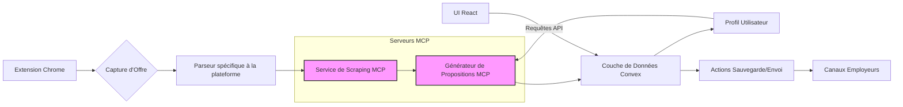

### **APERÇU DE L'ARCHITECTURE**  

Ce document fournit une vue d’ensemble détaillée de l’architecture de l’application **Job Proposal Generator**. Il décrit les composants du système, leurs rôles, leurs interactions et le flux global des données.  

---

## **1. Composants du Système**  

L'application est composée des éléments clés suivants :  

- **Extension Chrome :** Interface utilisateur permettant de capturer des offres d'emploi directement depuis les plateformes en ligne.  
- **Service de Scraping MCP :** Serveur MCP dédié à l'extraction du contenu des offres d'emploi sur diverses plateformes.  
- **Générateur de Propositions (Serveur MCP) :** Un autre serveur MCP qui utilise **LangChain** et **OpenAI** pour générer des propositions d'emploi personnalisées en fonction des offres capturées et des préférences de l’utilisateur.  
- **Couche de Données Convex :** Base de données en temps réel qui stocke les propositions, profils utilisateurs et l’état de l’application. Elle gère aussi l'authentification via **Clerk**.  
- **Composants UI React :** Interface utilisateur construite avec **React, Shadcn UI et TailwindCSS**, permettant l'affichage et la gestion des propositions et des paramètres utilisateur.  

---

## **2. Serveurs MCP : Rôles et Emplacements**  

L’application utilise **deux serveurs MCP distincts** pour séparer les responsabilités.  

### **MCP Scraping Service (`/mcp/scraping-server`)**  

- **Rôle :**  
  - Effectue le scraping web.  
  - Reçoit des requêtes de capture d’emploi depuis l’extension Chrome.  
  - Utilise des parseurs spécifiques aux plateformes pour extraire les détails des offres (titre, description, etc.).  
- **Emplacement :** `/mcp/scraping-server`  
- **Lancement :**  
  - Géré par le framework **Model Context Protocol (MCP)** via le fichier `cline_mcp_settings.json` (ou la configuration de Claude Desktop).  
  - Démarré automatiquement avec l’application.  
  - Configuration définissant la commande d’exécution (`node`), le point d’entrée (`build/index.js` après build) et les variables d’environnement nécessaires (ex. clés API).  

### **Générateur de Propositions MCP (`/mcp/proposal-server`)**  

- **Rôle :**  
  - Génère des propositions d'emploi avec **LangChain** et **OpenAI**.  
  - Reçoit le contenu des offres depuis le Service de Scraping.  
  - Récupère les préférences utilisateur depuis la **base de données Convex** (ex. ton, style d’écriture).  
- **Emplacement :** `/mcp/proposal-server`  
- **Lancement :**  
  - Géré par le framework MCP selon `cline_mcp_settings.json`.  
  - Requiert la configuration de la variable **`OPENAI_API_KEY`** pour accéder à l'API OpenAI.  

### **Résumé du Processus de Lancement des Serveurs MCP**  

1. **Configuration :** Définition des commandes et variables d’environnement dans `cline_mcp_settings.json` ou la configuration de Claude Desktop.  
2. **Démarrage Automatique :** Lecture des paramètres et lancement des serveurs MCP comme processus indépendants au démarrage de l’application.  
3. **Communication :** Interaction entre l’application (extension, UI React, fonctions Convex) et les serveurs via `use_mcp_tool` et `access_mcp_resource`.  

---

## **3. Flux de Données et Interactions**  

### **1. Capture d’Offre (Extension Chrome)**  
- L’utilisateur déclenche une capture sur une plateforme d’emploi.  
- L’extension envoie une requête contenant l’URL et la plateforme cible au backend.  

### **2. Scraping (Service MCP de Scraping)**  
- Le backend (via une fonction Convex ou un service React) appelle `use_mcp_tool` pour activer l’outil MCP `scrape_job`.  
- Le Service de Scraping récupère la page de l’offre et extrait les informations pertinentes.  
- Les données extraites sont renvoyées à l’application.  

### **3. Génération de Proposition (Générateur MCP)**  
- L’application appelle `use_mcp_tool` pour utiliser l’outil `generate_proposal`.  
- Le serveur reçoit :  
  - Le contenu de l’offre d’emploi.  
  - Les préférences utilisateur (ton, style).  
- Le Générateur de Propositions utilise **LangChain** et **OpenAI** pour générer un texte optimisé.  
- La proposition générée est renvoyée.  

### **4. Stockage des Données (Convex Data Layer)**  
- L’application stocke la proposition dans **Convex**, associée à l’utilisateur et aux métadonnées (plateforme, ID d’offre, statut).  

### **5. Interaction UI (Composants React & Convex)**  
- L’interface React récupère les propositions via des **requêtes Convex**.  
- Les actions utilisateur (ex. sauvegarde, envoi) déclenchent des **mutations Convex** pour mettre à jour les données.  

### **6. Envoi aux Employeurs (Actions Sauvegarde/Envoi)**  
- Possibilité d’envoyer la proposition via **email** ou **messagerie de la plateforme**.  
- Déclenché depuis l’UI React ou via une **fonction Convex** utilisant des services externes.  

---

## **4. Stack Technologique**  

### **Frontend :**  
- **React** – Framework UI  
- **TypeScript** – Typage fort et fiabilité  
- **Shadcn UI, Radix UI, TailwindCSS** – UI et styles  
- **React Query** – Gestion des données (potentiellement pour les requêtes Convex)  

### **Backend (Convex Data Layer) :**  
- **Convex** – Base de données serverless en temps réel  
- **Clerk** – Gestion de l’authentification  
- **TypeScript** – Langage pour les fonctions Convex  

### **Serveurs MCP :**  
- **Node.js** – Runtime d'exécution  
- **TypeScript** – Développement des serveurs MCP  
- **MCP SDK** – Framework de gestion des serveurs MCP  
- **LangChain** – Intégration de modèles de langage  
- **OpenAI API** – Génération de texte (via le Générateur MCP)  
- **Axios/Fetch** – Clients HTTP (Scraping & Génération)  

---

Cette architecture assure **modularité**, **séparation des responsabilités** (scraping, génération, stockage, UI) et **scalabilité**.  
- Les **serveurs MCP** encapsulent les intégrations externes (scraping, LLM).  
- **Convex** fournit une base de données en temps réel avec authentification.  
- **React** et les bibliothèques UI assurent une expérience utilisateur fluide et moderne.  

---

Ce format est structuré et clair pour faciliter la compréhension et l'implémentation par des développeurs expérimentés. 🚀