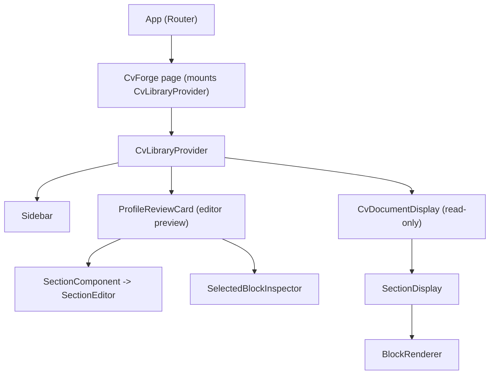

# ARCHITECTURE (extended)

This document is an updated architecture summary focused on the CV workspace and Convex backend hooks. It integrates the deeper scan of key files requested (contexts, pages, CV editor components, and convex functions). Use this as a working reference while we stabilize the UI and clean up legacy code.

Files I inspected for this update (representative)
- [`my-app/src/contexts/CvLibraryContext.tsx:1`](my-app/src/contexts/CvLibraryContext.tsx:1)
- [`my-app/src/components/ProfileReviewCard.tsx:1`](my-app/src/components/ProfileReviewCard.tsx:1)
- [`my-app/src/components/cv-display/CvDocumentDisplay.tsx:1`](my-app/src/components/cv-display/CvDocumentDisplay.tsx:1)
- [`my-app/src/components/cv-display/SectionDisplay.tsx:1`](my-app/src/components/cv-display/SectionDisplay.tsx:1)
- [`my-app/src/components/cv-editor/Section.tsx:1`](my-app/src/components/cv-editor/Section.tsx:1)
- [`my-app/src/components/cv-editor/CvEditor.tsx:1`](my-app/src/components/cv-editor/CvEditor.tsx:1)
- [`my-app/convex/profiles.ts:1`](my-app/convex/profiles.ts:1)

Overview
- The UI uses a single CV library context (`CvLibraryContext`) as the source of truth for all CV operations and state.
- Two primary UI surfaces render the same `currentCv`:
  - `ProfileReviewCard` — interactive block-based editor + inspector (editor-first surface).
  - `CvDocumentDisplay` — read-only full document display (print-style view).
- `CvForge` page mounts the provider and currently renders both surfaces simultaneously; that is the source of duplicate rendering.
- The Convex backend contains functions that persist profiles and support autosave / patch semantics; `profiles.ts` is the primary file handling profile upsert/patch/save operations.

Key responsibilities by module
- Context: [`CvLibraryContext`](my-app/src/contexts/CvLibraryContext.tsx:1)
  - Provides: currentCv, cvs, loadCv, saveCurrentCv, create/import helpers, atomic updates (updateBlockContent, updateBlockTitle, updateStructuredItem), inspector API (openInspector/closeInspector), active editor ID control, flush callbacks.
  - Implements safe merge and identity-preserving updates to reduce remount churn.
  - Debounced save implementation using an adapter (ConvexStorageAdapter).
- Editor surface: [`ProfileReviewCard`](my-app/src/components/ProfileReviewCard.tsx:1)
  - Hosts `SelectedBlockInspector` (single inspector modal) and the block-based editor via `SectionComponent` (`src/components/cv-editor/Section.tsx` -> `SectionEditor`).
  - Provides debug controls, add/remove helpers, drag-and-drop ordering via dnd-kit.
  - Uses context actions to mutate `currentCv`.
- Read-only surface: [`CvDocumentDisplay`](my-app/src/components/cv-display/CvDocumentDisplay.tsx:1)
  - Simple consumer rendering `currentCv.title` and mapping `currentCv.sections` -> `SectionDisplay`.
  - `SectionDisplay` iterates section.blocks and uses `BlockRenderer` for each block (read-only rendering path).
- Editor primitives:
  - `BlockRenderer` (my-app/src/components/cv-editor/BlockRenderer.tsx:1) renders an inline remirror editor when active OR a compact summary with Edit/Delete buttons that open the inspector.
  - `SectionEditor` provides the larger remirror-based editor for text sections.
- Convex backend: [`my-app/convex/profiles.ts:1`](my-app/convex/profiles.ts:1)
  - Implements secure queries and mutations: `get`, `upsert`, `patch`, `saveProfile`.
  - Patch API is defensive: validates inputs and maps fields to table schema, supports idempotency.
  - Used by UI autosave and server persistence flows.

Why duplication occurs
- `CvForge` renders both `ProfileReviewCard` and `CvDocumentDisplay`. Both subscribe to `CvLibraryContext.currentCv`.
- `ProfileReviewCard` intentionally renders an editor representation; `CvDocumentDisplay` renders a second representation for preview/print purposes.
- Running both in the same workspace leads to two mounted render trees of the same data, which causes confusing interactions (e.g., inspector and inline editor competing for state or DOM z-index).

Convex backend responsibilities (from `profiles.ts`)
- `get` - return profile tied to authenticated clerk user.
- `upsert` - insert/update user profile preferences and basic profile fields.
- `patch` - autosave-friendly patch endpoint; accepts `profile` (legacy full object) OR `patch` (partial) payloads; handles normalization and merging with existing profile document.
- `saveProfile` - idempotent public save endpoint used by UI fallback.

Redundant / legacy files worth reviewing
- `components.bak.*` directories and many `.bak` files — contain older copies, should be archived or deleted after verification.
- `components/cv-editor/Section.legacy.tsx` — flagged as removed (keeps a throw).
- Duplicate naming: `SectionEditor` vs `cv-editor/Section` (compat re-export). Confirm canonical name and remove duplicates.
- `adapters/StorageAdapter-legacy.md` — legacy adapter docs.
- Several `ProfileReviewModal.*.bak` and `ProfileForm.tsx.bak` remain — remove or move to an archive folder.

Mermaid diagram (high-level render tree)

Immediate recommendations (to stabilize UI)
1. Stop rendering both views simultaneously. Three practical options:
   - Option A (fast): remove `CvDocumentDisplay` from `my-app/src/pages/CvForge.tsx` so only `ProfileReviewCard` remains (editor-first, single source of interaction).
   - Option B (alternate): keep `CvDocumentDisplay` and reduce `ProfileReviewCard` to a compact toolbar + inspector host (remove its full `SectionComponent` rendering).
   - Option C (flexible): add an explicit toggle in `CvForge` to switch between Editor and Full Display (safe, explicit UX).
2. Clean up legacy `.bak` and `components.bak.*` to avoid accidental imports or confusion.
3. Add a smoke test / E2E check to assert that only one visible document tree is present in CvForge.

Next steps I can perform
- Implement Option A (remove `CvDocumentDisplay` from `CvForge`) — quick removal or toggle (already commented in the code).
- Implement Option C (toggle) so you can switch and compare both views interactively.
- Produce a separate cleanup PR removing backup directories and obsolete files (requires review).

If you want me to proceed, say which of the Next steps I should implement and I will make the change. I will not proceed until you confirm which approach you want me to take.